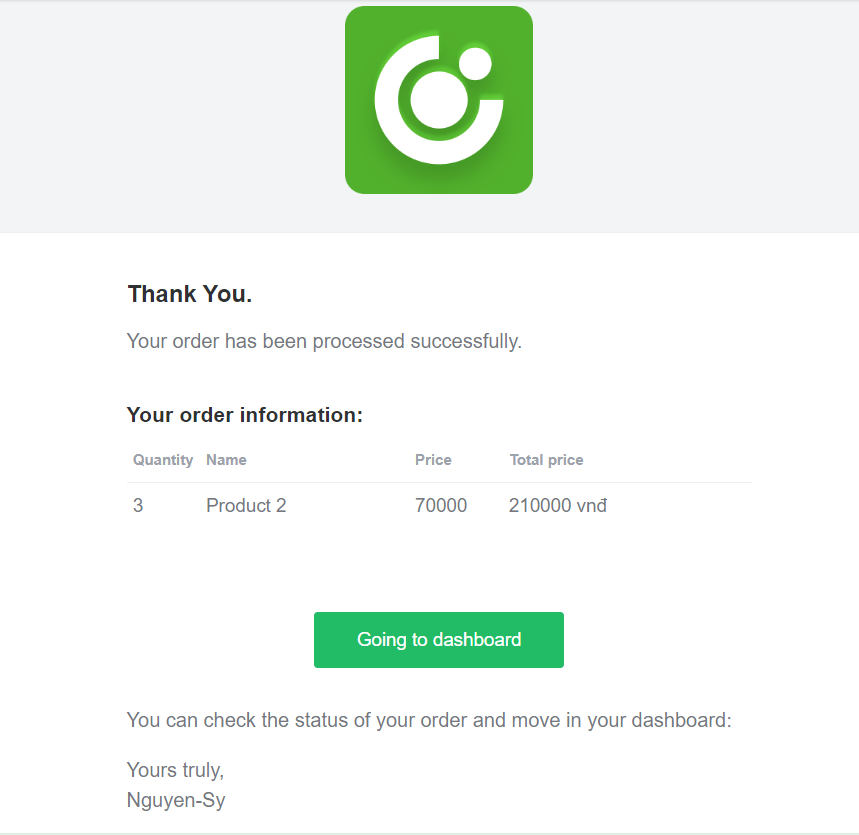

# Ecommerce 
#### Welcome to this project! This is Nguyen-Sy Ecommerce project and this file serves as a brief guide to help you get started.
***
## Project Overview:
*This project is the server-side component of an ecommerce website. It is responsible for managing various aspects of the ecommerce website, including product management, order processing, customer account management, and inventory management.*
***
## Installation:
**Before you continue, ensure you meet the following requirements**
* You have installed v18.16.0 Nodejs.
* You have installed Redis.
* You have a basic understanding of nodejs package manament.
> *$ npm run install*
***
## Running the app:
> *$ npm run dev*
## [Api document](https://documenter.getpostman.com/view/18966214/2s93zB72ZY)
api document: https://documenter.getpostman.com/view/18966214/2s93zB72ZY
*** 
## Contact:
Author: [Nguyen-Sy](https://www.facebook.com/profile.php?id=100008519955319)
Email: ***synguyentien.work@gmail.com***
***
## Thank you for using this project!

**Mail for register account:**

**Mail for placing order:**
